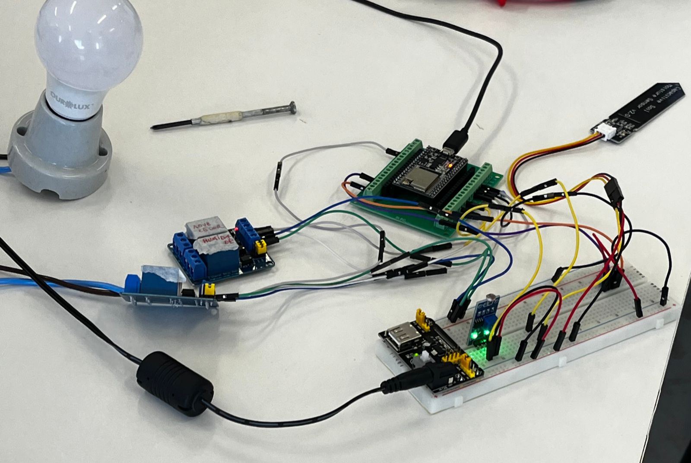
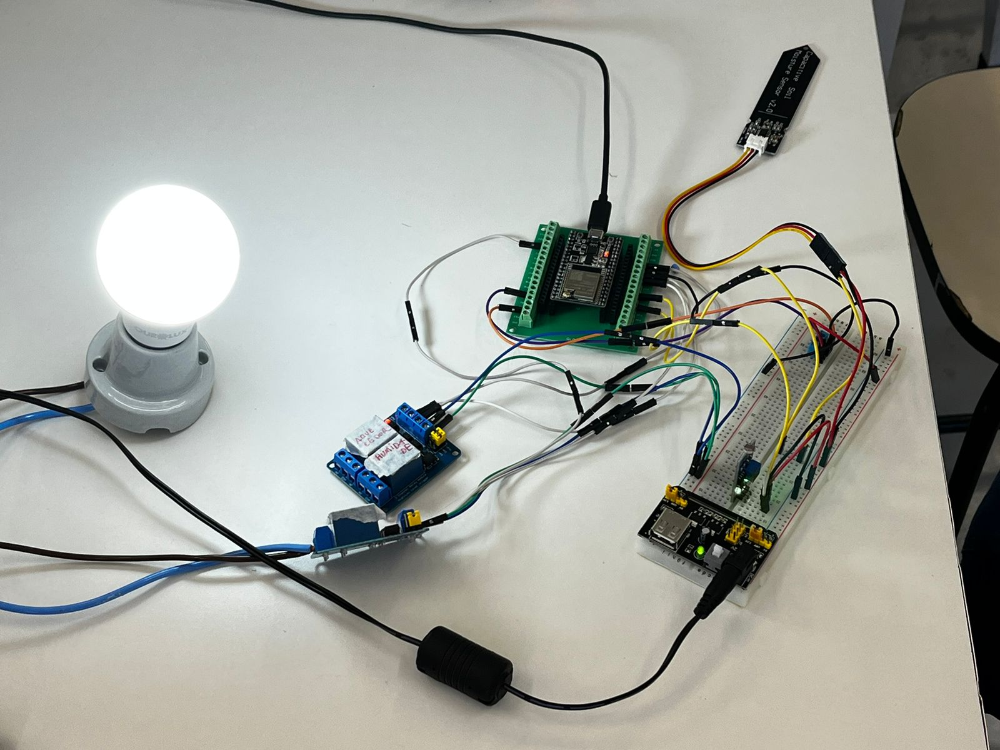
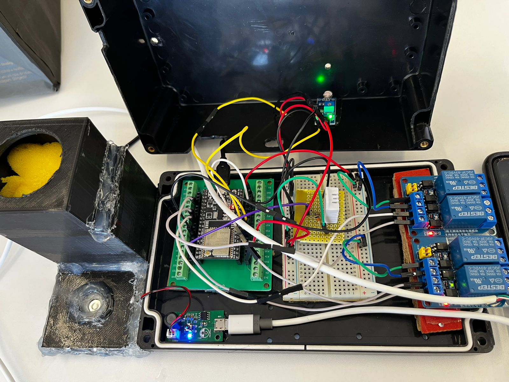
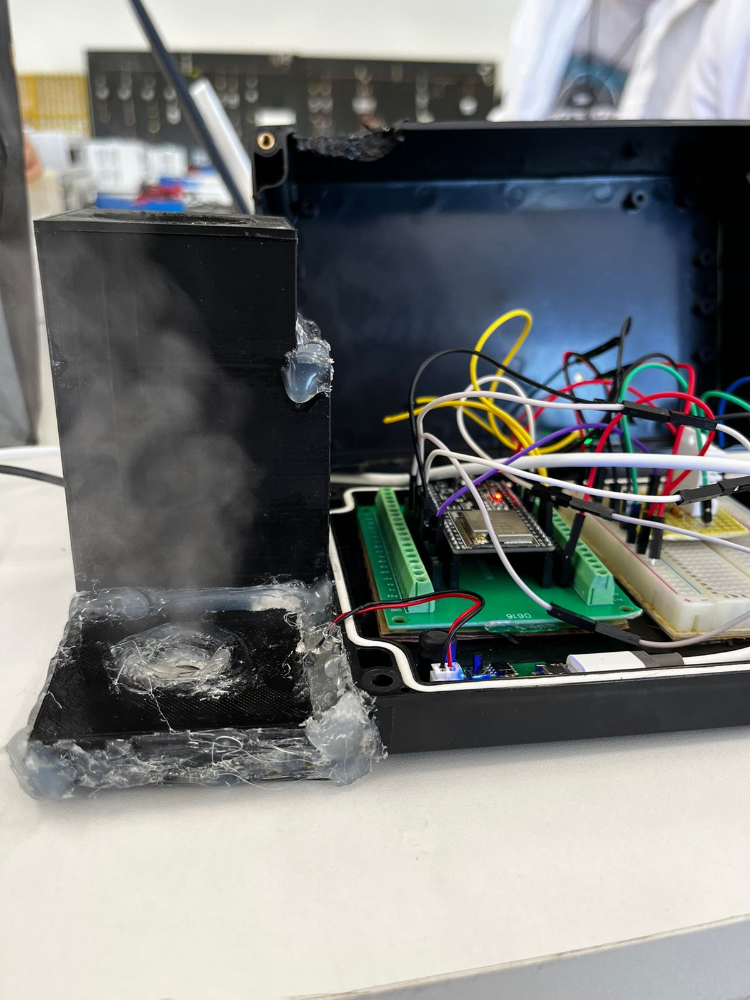

# Metereotech

**Uma estação meteorológica com controle on-off e integração com a nuvem para monitoramento de dados.**

## Ideia por trás do projeto:

No segundo semestre de 2023 fiz a matéria de controle analógico ministrada pela USF.

Nesse projeto em grupo deveríamos criar um sistema de controle em tempo contínuo para ao menos uma das variáveis que eram medidas por nossos sensores. Nos veio a ideia de controlar tudo aquilo que estávamos medindo utilizando transdutores.

Resolvemos criar uma estação meteorológica para controle de uma estufa.

Dentro do que queríamos controlar temos: a umidade do ar e do solo, a temperatura do ar e a luminosidade.

Dito isso, um dos outros requerimentos era a integração com a nuvem para o monitoramento desses dados por uma interface web.

Infelizmente não tenho acesso aos códigos utilizados no site criado para isso já que estávamos utilizando a conta pessoal de um dos integrantes do grupo para hospedar o site.

Dentro de nosso controle utilizamos um filtro de média móvel que se mostrou mais do que o suficiente para um projeto tão simples.

## Protótipo

### Itens utilizados

- DHT12
- ESP32 WROOM U32
- 2x Modulo de 2 relês
- Módulo LDR 500$\Omega$
- Fonte de breadboard
- Sensor de umidade do solo capacitivo

**Protótipo apagado:**

**Protótipo aceso:**

## Versão final:
### Itens Utilizados:
- DHT22
- ESP32 WROOM U32
- 2x Modulo de 2 relês
- Módulo LDR 500$\Omega$
- Fonte 12v
- Fonte 5v
- Sensor de umidade do solo capacitivo
- Bomba de água 12V
- Umidificador USB 40ml/h

**Versão final aberta:**

**Versão final funcionando:**

